# 环境

## Gello

直接拷贝电脑上的gello文件夹即可

注意修改 deploy 脚本中的 gello 路径


## docker使用脚本

在Robotwin项目根目录下


创建&进入容器

```bash
./script/_run_robotwin.sh dp3
# ./script/_run_robotwin.sh {policy_name}
```


删除容器

```bash
./script/_delete_docker.sh
```


# DP3

在A6000上复现Robotwin的DP3

[robotwin DP3 用户手册](https://robotwin-platform.github.io/doc/usage/DP3.html)


policy 路径参考如下：

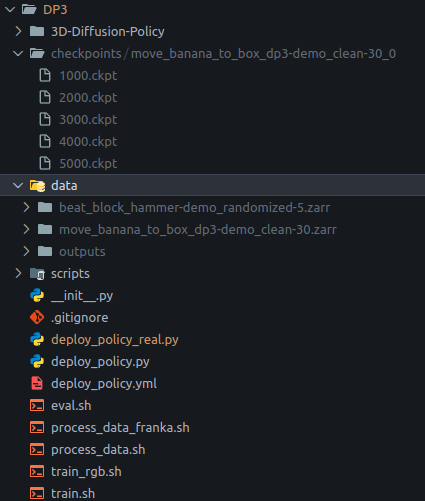


## dp3环境

创建容器

```bash
./script/_run_robotwin.sh dp3
```

```bash
blzou@rcvlab-A6000x4-0:/data/blzou/project/RoboTwin$ ./script/_run_robotwin.sh 
🆕 Create new container 'robotwin_dp3' 
7396733d0778b34717a8017e91cbf33e38fab6a9e41c7d7e6a4513bb3448700d
✅ Container created and patched, waiting for startup...
🚪 Entering container robotwin_dp3 ...
root@rcvlab-A6000x4-0:/workspace# 
```


安装 dp3 环境

```bash
cd policy/DP3/3D-Diffusion-Policy && pip install -e . && cd ..
pip install zarr==2.12.0 wandb ipdb gpustat dm_control omegaconf hydra-core==1.2.0 dill==0.3.5.1 einops==0.4.1 diffusers==0.11.1 numba==0.56.4 moviepy imageio av matplotlib termcolor
```


## 数据集转换（官方

> [ Robotwin](https://ccnk2vb1cc5g.feishu.cn/wiki/YddcwRUhTirCMQk9T8Yc4KiynFd#share-D5Y3dRjrWogn5ZxK0fIclnLhnyf)需要修改配置文件

```bash
bash process_data.sh beat_block_hammer demo_clean 5
# bash process_data.sh ${task_name} ${task_config} ${expert_data_num}
```

`expert_data_num` 参数指定要用作训练数据的轨迹数


## 数据集转换（我们自己的真机数据 pkl

> 包含点云的数据
>
> 需要修改内参和scal

数据集需要放在 `/data2/blzou/dataset/robotwin/data_real`

数据集操作路径是在docker里的 `/workspace/data_real` 下的 scripts

真机采集数据 .pkl 转换为 Robotwin格式的 .hdf5 文件

```bash
# python pkl_to_hdf5_folder_pc.py --pkl_dir /path/to/pkls --out_dir /path/to/h5s
python ./scripts/pkl_to_hdf5_folder_pc.py --pkl_dir /workspace/data_real/move_banana_to_box_pkl --out_dir /workspace/data_real/move_banana_to_box_dp3/demo_clean/data
```

> 输出格式：--out\_dir  task/demo\_clean/data/

> 添加了 --binarize\_gripper 的夹爪二值化参数

```bash
(RoboTwin) blzou@rcvlab-A6000x4-0:/data2/blzou/dataset/robotwin/data_real$ python ./scripts/pkl_to_hdf5_folder_pc.py --pkl_dir move_banana_to_box1030 --out_dir move_banana_to_box_dp3/demo_clean/data --binarize_gripper
```


.hdf5 转成 .zarr

```bash
bash process_data_franka.sh move_banana_to_box_dp3 demo_clean 1
# bash process_data_franka ${task_name} ${task_config} ${expert_data_num}
```

```bash
root@rcvlab-A6000x4-0:/workspace/policy/DP3# bash process_data_franka move_banana_to_box_dp3 demo_clean 1
processing episode: 1 / 1
```

保存在`/workspace/policy/DP3/data`目录下


## 训练

> [ Robotwin](https://ccnk2vb1cc5g.feishu.cn/wiki/YddcwRUhTirCMQk9T8Yc4KiynFd#share-N8V4diB1IoPApwxKbMccFsDtntb)注意修改


开始训练

```bash
bash train.sh beat_block_hammer demo_randomized 5 0 0
# bash train.sh ${task_name} ${task_config} ${expert_data_num} ${seed} ${gpu_id}
# bash train.sh move_banana_to_box_dp3 demo_clean 30 0 3
```

```bash
root@rcvlab-A6000x4-0:/workspace/policy/DP3# bash train.sh move_banana_to_box_dp3 demo_clean 30 0 3
```

默认情况下，模型将训练 3000 步，可在

`/workspace/policy/DP3/3D-Diffusion-Policy/diffusion_policy_3d/config/robot_dp3.yaml`中修改 num\_epochs 和 checkpoint\_every


开始训练（以rgb为例

```bash
bash train_rgb.sh move_banana_to_box_dp3 demo_clean 1 0 1
# bash train_rgb.sh ${task_name} ${task_config} ${expert_data_num} ${seed} ${gpu_id}
```

```bash
root@rcvlab-A6000x4-0:/workspace/policy/DP3# bash train_rgb.sh move_banana_to_box_dp3 demo_clean 1 0 1
gpu id (to use): 1
Train mode
/usr/local/lib/python3.10/dist-packages/hydra/_internal/defaults_list.py:251: UserWarning: In 'robot_dp3.yaml': Defaults list is missing `_self_`. See https://hydra.cc/docs/upgrades/1.0_to_1.1/default_composition_order for more information
  warnings.warn(msg, UserWarning)
[DP3Encoder] point cloud shape: [1024, 6]
[DP3Encoder] state shape: [8]
[DP3Encoder] imagination point shape: None
pointnet use_layernorm: True
pointnet use_final_norm: layernorm
[DP3Encoder] output dim: 192
[DiffusionUnetHybridPointcloudPolicy] use_pc_color: True
[DiffusionUnetHybridPointcloudPolicy] pointnet_type: pointnet
[2025-10-10 05:20:17,652][diffusion_policy_3d.model.diffusion.conditional_unet1d][INFO] - number of parameters: 2.623302e+08
----------------------------------
Class name: DP3
  Number of parameters: 262.5751M
   _dummy_variable: 0.0000M (0.00%)
   obs_encoder: 0.2449M (0.09%)
   model: 262.3302M (99.91%)
   mask_generator: 0.0000M (0.00%)
----------------------------------
Replay Buffer: state, shape (333, 8), dtype float32, range -2.49~2.29
Replay Buffer: action, shape (333, 8), dtype float32, range -2.49~2.29
Replay Buffer: point_cloud, shape (333, 1024, 6), dtype float32, range -7.18~30.00
--------------------------
-----------------------------
[WandB] group: move_banana_to_box_dp3-robot_dp3-train
[WandB] name: move_banana_to_box_dp3-demo_clean-1
-----------------------------
Training epoch 63:   0%|                                                                                                                                                                                                                                  | 0/2 [00:00<?, ?it/s]
saved in  checkpoints/move_banana_to_box_dp3-demo_clean-1_w_rgb_0/500.ckpt
```


## 评估

```bash
bash eval.sh beat_block_hammer demo_clean demo_clean 5 0 0
# bash eval.sh ${task_name} ${task_config} ${ckpt_setting} ${expert_data_num} ${seed} ${gpu_id}
```

`task_config` 字段指的是评估环境配置，而 `ckpt_setting` 字段指的是策略学习期间使用的训练数据配置

运行结果保存在项目根目录下的 `eval_result` 文件夹


> ⚠️如果需要RGB的话，infer需要以下配置文件的修改

* `policy/DP3/deploy_policy.yml`

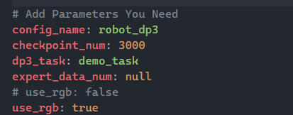

使用rgb


## 部署

修改 gello 的路径

在 `deploy_policy_real.py` 文件中

```python
sys.path.append('/workspace/third_party/gello_software_bp')
```


> 需要注意，franka采集到的数据的joint\_positions和joint\_velocities是一样的，而且都是包含gripper的
>
> 也就是说都是 8 维的

```bash
python deploy_policy_real.py 
```

```bash
root@rcvlab-A6000x4-0:/workspace/policy/DP3# python deploy_policy_real.py 
```


# RDT

rdt 路径参考如下：

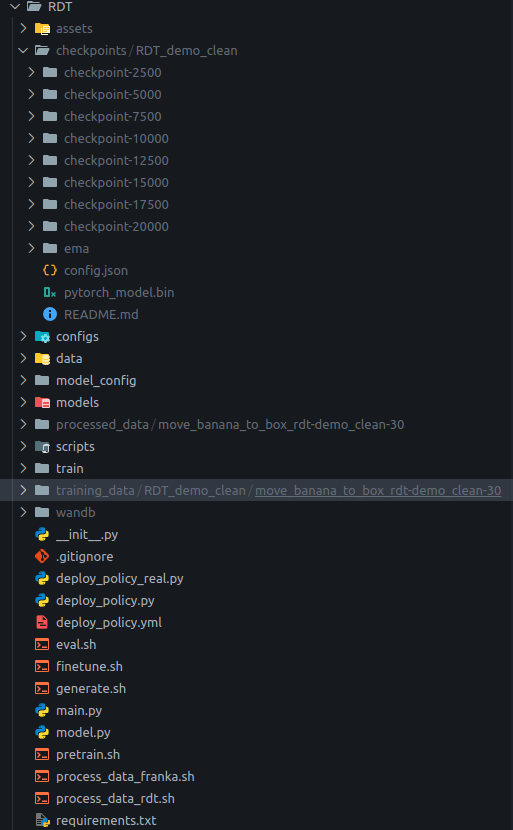


## rdt环境

创建并运行容器

```bash
./script/_run_robotwin.sh 
```

```bash
blzou@rcvlab-A6000x4-0:/data/blzou/project/RoboTwin$ ./script/_run_robotwin.sh rdt
🆕 Create new container 'robotwin_rdt' 
7396733d0778b34717a8017e91cbf33e38fab6a9e41c7d7e6a4513bb3448700d
✅ Container created and patched, waiting for startup...
🚪 Entering container robotwin_rdt...
root@rcvlab-A6000x4-0:/workspace# 
```


Pip 环境

```bash
# Install pytorch
# Look up https://pytorch.org/get-started/previous-versions/ with your cuda version for a correct command
pip install torch==2.1.0 torchvision==0.16.0  --index-url https://download.pytorch.org/whl/cu121

# Install packaging
pip install packaging==24.0
pip install ninja
# Verify Ninja --> should return exit code "0"
ninja --version; echo $?
# Install flash-attn
pip install flash-attn==2.7.2.post1 --no-build-isolation

# Install other prequisites
pip install -r requirements.txt
# If you are using a PyPI mirror, you may encounter issues when downloading tfds-nightly and tensorflow. 
# Please use the official source to download these packages.
# pip install tfds-nightly==4.9.4.dev202402070044 -i  https://pypi.org/simple
# pip install tensorflow==2.15.0.post1 -i  https://pypi.org/simple
```


下载模型

```bash
# In the ROOT directory
cd policy 
mkdir weights
cd weights
mkdir RDT && cd RDT
# Download the models used by RDT
huggingface-cli download google/t5-v1_1-xxl --local-dir t5-v1_1-xxl
huggingface-cli download google/siglip-so400m-patch14-384 --local-dir siglip-so400m-patch14-384
huggingface-cli download robotics-diffusion-transformer/rdt-1b --local-dir rdt-1b
```

> 模型保存的路径在服务器的`/data2/blzou/dataset/robotwin/ckpt/weights`
>
> 在容器的`/workspace/ckpt/weights`


## 数据集转换（ours

数据集需要放在 `/data2/blzou/dataset/robotwin/data_real`

路径是在docker里的 `/workspace/data_real` 下的 scripts

.pkl 转 .hdf5

```bash
python pkl_to_hdf5_folder_resize.py --pkl_dir /path/to/pkls --out_dir /path/to/h5s
# python scripts/pkl_to_hdf5_folder_resize.py --pkl_dir ./move_banana_to_box1030_compress --out_dir move_banana_to_box_rdt/demo_clean/data --binarize_gripper
```

```bash
(RoboTwin) blzou@rcvlab-A6000x4-0:/data2/blzou/dataset/robotwin/data_real$ python scripts/pkl_to_hdf5_folder_resize.py --pkl_dir ./move_banana_to_box1030_compress --out_dir move_banana_to_box_rdt/demo_clean/data --binarize_gripper
```

> 输出格式：--out\_dir  task/demo\_clean/data/
>
> 同样有夹爪二值化选项


我们的数据集h5格式

```bash
🔍 Inspecting HDF5 file: ./move_banana_to_box/demo_clean/data/0.hdf5
============================================================
Dataset: endpose/ee_pos_quat
  Shape: (334, 7)
  Dtype: float64
--------------------------------------------------
Dataset: endpose/gripper
  Shape: (334,)
  Dtype: float32
--------------------------------------------------
Dataset: joint_action/gripper
  Shape: (334,)
  Dtype: float32
--------------------------------------------------
Dataset: joint_action/positions
  Shape: (334, 7)
  Dtype: float32
--------------------------------------------------
Dataset: joint_action/velocities
  Shape: (334, 8)
  Dtype: float32
--------------------------------------------------
Dataset: observation/front_camera/depth_raw
  Shape: (334, 480, 640, 1)
  Dtype: float32
--------------------------------------------------
Dataset: observation/front_camera/rgb
  Shape: (334,)
  Dtype: |S16095
--------------------------------------------------
✅ Inspection complete.
```


我们的 .hdf5 改成 RDT 所需的 .hdf5

以及生成 RDT 所需的 instructions（.pt

> 需要修改 encode model 的路径
>
> `/workspace/policy/RDT/scripts/encode_lang_batch_once.py`


```bash
python ./scripts/generate_instructions.py --task_dir /path/to/h5s
# python ./scripts/generate_instructions.py --task_dir ./move_banana_to_box_rdt/demo_clean
```

```bash
(RoboTwin) blzou@rcvlab-A6000x4-0:/data2/blzou/dataset/robotwin/data_real$ python ./scripts/generate_instructions.py --task_dir ./move_banana_to_box_rdt/demo_clean
```

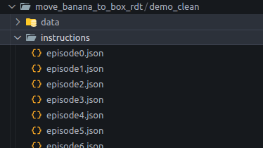


创建文件夹

在docker中`/workspace/policy/RDT`下：

```bash
mkdir processed_data && mkdir training_data
```


```bash
bash process_data_franka.sh move_banana_to_box demo_clean 1 3
# bash process_data_franka ${task_name} ${task_config} ${expert_data_num} ${gpu_id}
```

```bash
# root@rcvlab-A6000x4-0:/workspace/policy/RDT# bash process_data_franka.sh move_banana_to_box_rdt demo_clean 30 3
```

保存路径在`/workspace/policy/RDT/processed_data`下

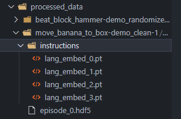


## 训练

生成配置文件

> 需修改预训练模型路径
>
> `/workspace/policy/RDT/model_config/_generate_model_config.py`

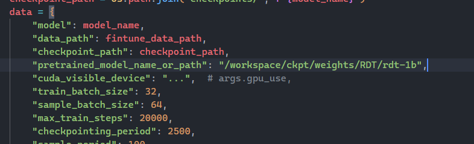


`$model_name` 管理模型的训练，包括训练数据和训练配置

```bash
bash generate.sh ${model_name}
# bash generate.sh RDT_demo_clean
```

```bash
root@rcvlab-A6000x4-0:/workspace/policy/RDT# bash generate.sh RDT_demo_clean
```

这将在 training\_data 下创建一个名为 `\${model_name}` 的文件夹，并在 model\_config 下创建一个配置文件 `\${model_name}.yml`


转移训练数据

从 `processed_data` 复制到 `training_data/${model_name}`

`training_data`结构类似如下：

```bash
training_data/${model_name}
├── ${task_1}
│   ├── episode_0
|   |   |── episode_0.hdf5
|   |   |-- instructions
|   │   │   ├── lang_embed_0.pt
|   │   │   ├── ...
├── ${task_2}
│   ├── ...
├── ...
```

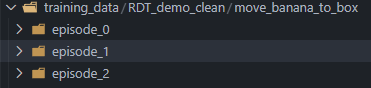


训练

> 需修改siglip-so400m-patch14-384模型路径
>
> `policy/RDT/finetune.sh`

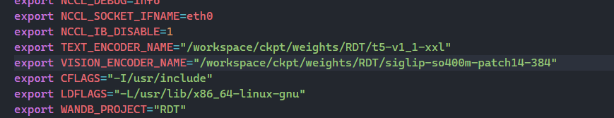


```bash
bash finetune.sh ${model_name}
# bash finetune.sh RDT_demo_clean
```

```bash
root@rcvlab-A6000x4-0:/workspace/policy/RDT# bash finetune.sh RDT_demo_clean
```

中途中断了接着训练可以查看下面文档

[ Franka（Robotwin](https://ccnk2vb1cc5g.feishu.cn/wiki/YddcwRUhTirCMQk9T8Yc4KiynFd#CSbId1N7ToE8wOxg6IacL0FBnuA)


## 部署

修改 gello 的路径

在 `deploy_policy_real.py` 文件中

```python
sys.path.append('/workspace/third_party/gello_software_bp')
```


```bash
python deploy_policy_real.py 
```

```bash
root@rcvlab-A6000x4-0:/workspace/policy/RDT# python deploy_policy_real.py 
```


# 踩坑记录

## DP3：准备训练数据时，报 ZeroDivisionError: division by zero 错误

```bash
root@rcvlab-A6000x4-0:/workspace/policy/DP3# bash process_data.sh beat_block_hammer demo_randomized 10
processing episode: 10 / 10
If you get a `ZeroDivisionError: division by zero`, check that `data/pointcloud` in the task config is set to true.
Traceback (most recent call last):
  File "/workspace/policy/DP3/scripts/process_data.py", line 152, in <module>
    main()
  File "/workspace/policy/DP3/scripts/process_data.py", line 114, in main
    zarr_data.create_dataset(
  File "/usr/local/lib/python3.10/dist-packages/zarr/hierarchy.py", line 948, in create_dataset
    return self._write_op(self._create_dataset_nosync, name, **kwargs)
  File "/usr/local/lib/python3.10/dist-packages/zarr/hierarchy.py", line 800, in _write_op
    return f(*args, **kwargs)
  File "/usr/local/lib/python3.10/dist-packages/zarr/hierarchy.py", line 965, in _create_dataset_nosync
    a = array(data, store=self._store, path=path, chunk_store=self._chunk_store,
  File "/usr/local/lib/python3.10/dist-packages/zarr/creation.py", line 380, in array
    z[...] = data
  File "/usr/local/lib/python3.10/dist-packages/zarr/core.py", line 1353, in __setitem__
    self.set_basic_selection(pure_selection, value, fields=fields)
  File "/usr/local/lib/python3.10/dist-packages/zarr/core.py", line 1448, in set_basic_selection
    return self._set_basic_selection_nd(selection, value, fields=fields)
  File "/usr/local/lib/python3.10/dist-packages/zarr/core.py", line 1746, in _set_basic_selection_nd
    indexer = BasicIndexer(selection, self)
  File "/usr/local/lib/python3.10/dist-packages/zarr/indexing.py", line 342, in __init__
    dim_indexer = SliceDimIndexer(dim_sel, dim_len, dim_chunk_len)
  File "/usr/local/lib/python3.10/dist-packages/zarr/indexing.py", line 176, in __init__
    self.nchunks = ceildiv(self.dim_len, self.dim_chunk_len)
  File "/usr/local/lib/python3.10/dist-packages/zarr/indexing.py", line 160, in ceildiv
    return math.ceil(a / b)
ZeroDivisionError: division by zero
```

> 原因是 由于 **DP3** 是需要点云输入的 3D 策略，因此请确保在数据采集时将 `data_type/pointcloud` 设置为 `true`

修改 `task_config/demo_randomized.yml`对应的配置文件后，重新收集数据

```bash
# if you want to modify the config, please check the following tutorial first:
# https://robotwin-platform.github.io/doc/usage/configurations.html
render_freq: 0
episode_num: 10
use_seed: false
save_freq: 15
embodiment: [aloha-agilex]
language_num: 100
domain_randomization:
  random_background: true
  cluttered_table: true
  clean_background_rate: 0.02
  random_head_camera_dis: 0
  random_table_height: 0.03
  random_light: true
  crazy_random_light_rate: 0.02
camera:
  head_camera_type: D435
  wrist_camera_type: D435
  collect_head_camera: true
  collect_wrist_camera: true
data_type:
  rgb: true
  third_view: false
  depth: false
  pointcloud: true
  # pointcloud: false
  observer: false
  endpose: true
  qpos: true
  mesh_segmentation: false
  actor_segmentation: false
pcd_down_sample_num: 1024
pcd_crop: true
save_path: ./data
clear_cache_freq: 5
collect_data: true
eval_video_log: true

```


## DP3：训练时，shm共享内存不足报错

```bash
root@rcvlab-A6000x4-0:/workspace/policy/DP3# bash train.sh beat_block_hammer demo_randomized 5 0 0
gpu id (to use): 0
Train mode
/usr/local/lib/python3.10/dist-packages/hydra/_internal/defaults_list.py:251: UserWarning: In 'robot_dp3.yaml': Defaults list is missing `_self_`. See https://hydra.cc/docs/upgrades/1.0_to_1.1/default_composition_order for more information
  warnings.warn(msg, UserWarning)
[DP3Encoder] point cloud shape: [1024, 6]
[DP3Encoder] state shape: [14]
[DP3Encoder] imagination point shape: None
[PointNetEncoderXYZ] use_layernorm: True
[PointNetEncoderXYZ] use_final_norm: layernorm
[DP3Encoder] output dim: 192
[DiffusionUnetHybridPointcloudPolicy] use_pc_color: False
[DiffusionUnetHybridPointcloudPolicy] pointnet_type: pointnet
[2025-09-30 07:14:15,403][diffusion_policy_3d.model.diffusion.conditional_unet1d][INFO] - number of parameters: 2.623517e+08
----------------------------------
Class name: DP3
  Number of parameters: 262.4325M
   _dummy_variable: 0.0000M (0.00%)
   obs_encoder: 0.0808M (0.03%)
   model: 262.3517M (99.97%)
   mask_generator: 0.0000M (0.00%)
----------------------------------
Replay Buffer: state, shape (581, 14), dtype float32, range -1.79~2.91
Replay Buffer: action, shape (581, 14), dtype float32, range -1.79~2.91
Replay Buffer: point_cloud, shape (581, 1024, 6), dtype float32, range -0.43~1.20
--------------------------
-----------------------------
[WandB] group: beat_block_hammer-robot_dp3-train
[WandB] name: beat_block_hammer-demo_randomized-5
-----------------------------
Training epoch 0:   0%|                                                        | 0/2 [00:00<?, ?it/s]ERROR: Unexpected bus error encountered in worker. This might be caused by insufficient shared memory (shm).
ERROR: Unexpected bus error encountered in worker. This might be caused by insufficient shared memory (shm).
Error executing job with overrides: ['task_name=beat_block_hammer', 'training.debug=False', 'training.seed=0', 'training.device=cuda:0', 'exp_name=beat_block_hammer-robot_dp3-train', 'logging.mode=online', 'checkpoint.save_ckpt=True', 'expert_data_num=5', 'setting=demo_randomized']
Traceback (most recent call last):
  File "/usr/local/lib/python3.10/dist-packages/torch/utils/data/dataloader.py", line 1131, in _try_get_data
    data = self._data_queue.get(timeout=timeout)
  File "/usr/lib/python3.10/queue.py", line 180, in get
    self.not_empty.wait(remaining)
  File "/usr/lib/python3.10/threading.py", line 324, in wait
    gotit = waiter.acquire(True, timeout)
  File "/usr/local/lib/python3.10/dist-packages/torch/utils/data/_utils/signal_handling.py", line 67, in handler
    _error_if_any_worker_fails()
RuntimeError: DataLoader worker (pid 43288) is killed by signal: Bus error. It is possible that dataloader's workers are out of shared memory. Please try to raise your shared memory limit.

The above exception was the direct cause of the following exception:

Traceback (most recent call last):
  File "/workspace/policy/DP3/3D-Diffusion-Policy/train_dp3.py", line 478, in <module>
    main()
  File "/usr/local/lib/python3.10/dist-packages/hydra/main.py", line 90, in decorated_main
    _run_hydra(
  File "/usr/local/lib/python3.10/dist-packages/hydra/_internal/utils.py", line 389, in _run_hydra
    _run_app(
  File "/usr/local/lib/python3.10/dist-packages/hydra/_internal/utils.py", line 452, in _run_app
    run_and_report(
  File "/usr/local/lib/python3.10/dist-packages/hydra/_internal/utils.py", line 216, in run_and_report
    raise ex
  File "/usr/local/lib/python3.10/dist-packages/hydra/_internal/utils.py", line 213, in run_and_report
    return func()
  File "/usr/local/lib/python3.10/dist-packages/hydra/_internal/utils.py", line 453, in <lambda>
    lambda: hydra.run(
  File "/usr/local/lib/python3.10/dist-packages/hydra/_internal/hydra.py", line 132, in run
    _ = ret.return_value
  File "/usr/local/lib/python3.10/dist-packages/hydra/core/utils.py", line 260, in return_value
    raise self._return_value
  File "/usr/local/lib/python3.10/dist-packages/hydra/core/utils.py", line 186, in run_job
    ret.return_value = task_function(task_cfg)
  File "/workspace/policy/DP3/3D-Diffusion-Policy/train_dp3.py", line 474, in main
    workspace.run()
  File "/workspace/policy/DP3/3D-Diffusion-Policy/train_dp3.py", line 192, in run
    for batch_idx, batch in enumerate(tepoch):
  File "/usr/local/lib/python3.10/dist-packages/tqdm/std.py", line 1181, in __iter__
    for obj in iterable:
  File "/usr/local/lib/python3.10/dist-packages/torch/utils/data/dataloader.py", line 630, in __next__
    data = self._next_data()
  File "/usr/local/lib/python3.10/dist-packages/torch/utils/data/dataloader.py", line 1327, in _next_data
    idx, data = self._get_data()
  File "/usr/local/lib/python3.10/dist-packages/torch/utils/data/dataloader.py", line 1283, in _get_data
    success, data = self._try_get_data()
  File "/usr/local/lib/python3.10/dist-packages/torch/utils/data/dataloader.py", line 1144, in _try_get_data
    raise RuntimeError(f'DataLoader worker (pid(s) {pids_str}) exited unexpectedly') from e
RuntimeError: DataLoader worker (pid(s) 43288) exited unexpectedly
```

> 原因是dp3的训练数据是点云，内存占用比较大，而且 Pytorch 的 dataloader 使用多进程时，会通过 shm传输数据，docker 启动容器后，默认 shm 大小是 64MB，需要进行扩大

```bash
root@rcvlab-A6000x4-0:/workspace/policy/DP3# df -h /dev/shm
Filesystem      Size  Used Avail Use% Mounted on
shm              64M   35M   30M  55% /dev/shm
```


对 `_run_robotwin.sh` 进行修改，添加 --shm-size=8g

```bash
docker run -d \
    --name "$CONTAINER_NAME" \
    --gpus all \
    --shm-size=8g \
    --network=host \
    --privileged \
    -e NVIDIA_DRIVER_CAPABILITIES=compute,utility,graphics \
    -e CKPT_PATH="$CKPT_PATH" \
    -v "$CURRENT_DIR":/workspace \
    -v "$ASSETS_PATH/assets:/workspace/assets" \
    -v "$ASSETS_PATH/data:/workspace/data" \
    -w /workspace \
    "$IMAGE" \
    bash -c "
        tail -f /dev/null
    "

echo "✅ Container created and patched, waiting for startup..."
sleep 2
```


## DP3：训练时报 state 维度错误

```bash
Error executing job with overrides: ['task_name=move_banana_to_box_dp3', 'training.debug=False', 'training.seed=0', 'training.device=cuda:0', 'exp_name=move_banana_to_box_dp3-robot_dp3-train', 'logging.mode=online', 'checkpoint.save_ckpt=True', 'expert_data_num=1', 'setting=demo_clean']
Traceback (most recent call last):
  File "/workspace/policy/DP3/3D-Diffusion-Policy/train_dp3.py", line 478, in <module>
    main()
  File "/usr/local/lib/python3.10/dist-packages/hydra/main.py", line 90, in decorated_main
    _run_hydra(
  File "/usr/local/lib/python3.10/dist-packages/hydra/_internal/utils.py", line 389, in _run_hydra
    _run_app(
  File "/usr/local/lib/python3.10/dist-packages/hydra/_internal/utils.py", line 452, in _run_app
    run_and_report(
  File "/usr/local/lib/python3.10/dist-packages/hydra/_internal/utils.py", line 216, in run_and_report
    raise ex
  File "/usr/local/lib/python3.10/dist-packages/hydra/_internal/utils.py", line 213, in run_and_report
    return func()
  File "/usr/local/lib/python3.10/dist-packages/hydra/_internal/utils.py", line 453, in <lambda>
    lambda: hydra.run(
  File "/usr/local/lib/python3.10/dist-packages/hydra/_internal/hydra.py", line 132, in run
    _ = ret.return_value
  File "/usr/local/lib/python3.10/dist-packages/hydra/core/utils.py", line 260, in return_value
    raise self._return_value
  File "/usr/local/lib/python3.10/dist-packages/hydra/core/utils.py", line 186, in run_job
    ret.return_value = task_function(task_cfg)
  File "/workspace/policy/DP3/3D-Diffusion-Policy/train_dp3.py", line 474, in main
    workspace.run()
  File "/workspace/policy/DP3/3D-Diffusion-Policy/train_dp3.py", line 201, in run
    raw_loss, loss_dict = self.model.compute_loss(batch)
  File "/workspace/policy/DP3/3D-Diffusion-Policy/diffusion_policy_3d/policy/dp3.py", line 290, in compute_loss
    nobs_features = self.obs_encoder(this_nobs)
  File "/usr/local/lib/python3.10/dist-packages/torch/nn/modules/module.py", line 1553, in _wrapped_call_impl
    return self._call_impl(*args, **kwargs)
  File "/usr/local/lib/python3.10/dist-packages/torch/nn/modules/module.py", line 1562, in _call_impl
    return forward_call(*args, **kwargs)
  File "/workspace/policy/DP3/3D-Diffusion-Policy/diffusion_policy_3d/model/vision/pointnet_extractor.py", line 263, in forward
    state_feat = self.state_mlp(state)  # B * 64
  File "/usr/local/lib/python3.10/dist-packages/torch/nn/modules/module.py", line 1553, in _wrapped_call_impl
    return self._call_impl(*args, **kwargs)
  File "/usr/local/lib/python3.10/dist-packages/torch/nn/modules/module.py", line 1562, in _call_impl
    return forward_call(*args, **kwargs)
  File "/usr/local/lib/python3.10/dist-packages/torch/nn/modules/container.py", line 219, in forward
    input = module(input)
  File "/usr/local/lib/python3.10/dist-packages/torch/nn/modules/module.py", line 1553, in _wrapped_call_impl
    return self._call_impl(*args, **kwargs)
  File "/usr/local/lib/python3.10/dist-packages/torch/nn/modules/module.py", line 1562, in _call_impl
    return forward_call(*args, **kwargs)
  File "/usr/local/lib/python3.10/dist-packages/torch/nn/modules/linear.py", line 117, in forward
    return F.linear(input, self.weight, self.bias)
RuntimeError: mat1 and mat2 shapes cannot be multiplied (768x8 and 14x64)
```

> 原因时 state 维度不匹配，将下图中的 14 改成 8 即可

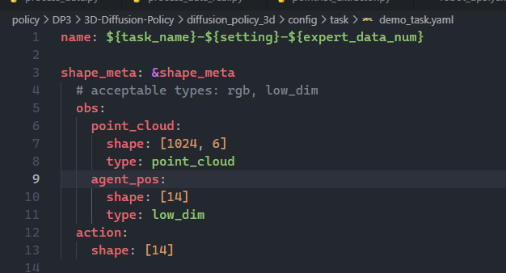


## DP3: ckpt无法接着继续训练

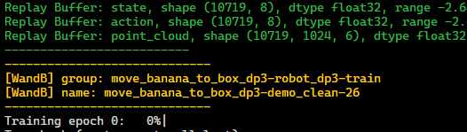

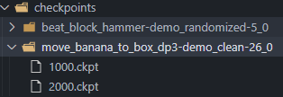

> 无法读取到最新的ckpt接着训练

> 原因是源代码有逻辑有问题，需要修改
>
> `/workspace/policy/DP3/3D-Diffusion-Policy/train_dp3.py`文件中的 get\_checkpoint\_path 函数

```bash
def get_checkpoint_path(self, tag="latest"):
    checkpoint_dir = pathlib.Path(DP3_ROOT).joinpath(f"checkpoints/{self.cfg.task.name}_{self.cfg.training.seed}")
    if tag == "latest":
        # return pathlib.Path(self.output_dir).joinpath("checkpoints", f"{tag}.ckpt")
        ckpt_files = list(checkpoint_dir.glob("*.ckpt"))
        if not ckpt_files:
            return None
        
        # 按修改时间（mtime）降序排序，取最新的
        latest_ckpt = max(ckpt_files, key=lambda f: f.stat().st_mtime)
        return latest_ckpt
    elif tag == "best":
        # the checkpoints are saved as format: epoch={}-test_mean_score={}.ckpt
        # find the best checkpoint
        # checkpoint_dir = pathlib.Path(self.output_dir).joinpath("checkpoints")
        all_checkpoints = os.listdir(checkpoint_dir)
        best_ckpt = None
        best_score = -1e10
        for ckpt in all_checkpoints:
            if "latest" in ckpt:
                continue
            score = float(ckpt.split("test_mean_score=")[1].split(".ckpt")[0])
            if score > best_score:
                best_ckpt = ckpt
                best_score = score
        return pathlib.Path(self.output_dir).joinpath("checkpoints", best_ckpt)
    else:
        raise NotImplementedError(f"tag {tag} not implemented")
```

> 并且需要修改配置文件`/workspace/policy/DP3/3D-Diffusion-Policy/diffusion_policy_3d/config/robot_dp3.yaml`

```bash
...
training:
  ...
  resume: True    # 修改为True
```


## DP3: 部署推理过程中 gripper 不 work

```bash
gripper : 0.7045450806617737
gripper : 0.7031018137931824
gripper : 0.7035694718360901
gripper : 0.7058286070823669
gripper : 0.7057570219039917
gripper : 0.705588161945343
gripper : 0.7053167223930359
gripper : 0.7045924663543701
gripper : 0.7048159241676331
gripper : 0.7052463889122009
gripper : 0.7050356268882751
gripper : 0.7038112282752991
gripper : 0.7031931281089783
gripper : 0.7024000287055969
gripper : 0.7028611302375793
gripper : 0.705430805683136
gripper : 0.70560222864151
gripper : 0.7048481702804565
gripper : 0.7041599750518799
gripper : 0.7030879259109497
gripper : 0.7033390998840332
gripper : 0.7063479423522949
gripper : 0.7056357860565186
gripper : 0.7050377726554871
gripper : 0.7037075161933899
gripper : 0.7012830376625061
gripper : 0.6996189951896667
```

> 打印出来的 gripper 值一直在 0.7 左右
>
> 问题思路：
>
> 1. 先以为是抓取的置信区间太小，但经过夹爪二值化之后，依然不work
>
> 2. 再给 traj 做抽帧后，运动十分丝滑，gripper也成功work

> 原因分析：
>
> * 抽帧是工程上的优化，在真机部署中有很多的噪声，如果不做抽帧，那么模型在学的时候会把每个点都学到，导致收敛域比较强，最后的结果就是gripper不work，因为中间一些点没到位？
>
> * 简单来说就是，把整个轨迹变成一些特定的关键点，只要机械臂到了那个位置即可，大大提高了成功率


## RDT: 多卡训练报错

```bash
10/14/2025 12:03:50 - INFO - __main__ - Constructing model from pretrained checkpoint.
Diffusion params: 1.228320e+09
Loading weights from local directory
Diffusion params: 1.228320e+09
Loading weights from local directory
/usr/local/lib/python3.10/dist-packages/torch/_utils.py:831: UserWarning: TypedStorage is deprecated. It will be removed in the future and UntypedStorage will be the only storage class. This should only matter to you if you are using storages directly.  To access UntypedStorage directly, use tensor.untyped_storage() instead of tensor.storage()
  return self.fget.__get__(instance, owner)()
/usr/local/lib/python3.10/dist-packages/torch/_utils.py:831: UserWarning: TypedStorage is deprecated. It will be removed in the future and UntypedStorage will be the only storage class. This should only matter to you if you are using storages directly.  To access UntypedStorage directly, use tensor.untyped_storage() instead of tensor.storage()
  return self.fget.__get__(instance, owner)()
10/14/2025 12:04:44 - INFO - accelerate.accelerator - Since you passed both train and evaluation dataloader, `is_train_batch_min` (here True will decide the `train_batch_size` (32).
[2025-10-14 12:04:44,277] [INFO] [logging.py:96:log_dist] [Rank 0] DeepSpeed info: version=0.14.2, git-hash=unknown, git-branch=unknown
rcvlab-A6000x4-0:223645:223645 [0] NCCL INFO NCCL_SOCKET_IFNAME set by environment to eth0

rcvlab-A6000x4-0:223645:223645 [0] bootstrap.cc:45 NCCL WARN Bootstrap : no socket interface found
rcvlab-A6000x4-0:223645:223645 [0] NCCL INFO init.cc:82 -> 3
rcvlab-A6000x4-0:223645:223645 [0] NCCL INFO init.cc:101 -> 3
Traceback (most recent call last):
  File "/workspace/policy/RDT/main.py", line 344, in <module>
    train(args, logger)
  File "/workspace/policy/RDT/train/train.py", line 312, in train
    rdt, optimizer, train_dataloader, sample_dataloader, lr_scheduler = (accelerator.prepare(
  File "/usr/local/lib/python3.10/dist-packages/accelerate/accelerator.py", line 1284, in prepare
    result = self._prepare_deepspeed(*args)
  File "/usr/local/lib/python3.10/dist-packages/accelerate/accelerator.py", line 1751, in _prepare_deepspeed
    engine, optimizer, _, lr_scheduler = deepspeed.initialize(**kwargs)
  File "/usr/local/lib/python3.10/dist-packages/deepspeed/__init__.py", line 181, in initialize
    engine = DeepSpeedEngine(args=args,
  File "/usr/local/lib/python3.10/dist-packages/deepspeed/runtime/engine.py", line 262, in __init__
    self._configure_distributed_model(model)
  File "/usr/local/lib/python3.10/dist-packages/deepspeed/runtime/engine.py", line 1157, in _configure_distributed_model
    self._broadcast_model()
  File "/usr/local/lib/python3.10/dist-packages/deepspeed/runtime/engine.py", line 1077, in _broadcast_model
    dist.broadcast(p.data, groups._get_broadcast_src_rank(), group=self.seq_data_parallel_group)
  File "/usr/local/lib/python3.10/dist-packages/deepspeed/comm/comm.py", line 117, in log_wrapper
    return func(*args, **kwargs)
  File "/usr/local/lib/python3.10/dist-packages/deepspeed/comm/comm.py", line 224, in broadcast
    return cdb.broadcast(tensor=tensor, src=src, group=group, async_op=async_op)
  File "/usr/local/lib/python3.10/dist-packages/torch/_dynamo/eval_frame.py", line 328, in _fn
    return fn(*args, **kwargs)
  File "/usr/local/lib/python3.10/dist-packages/deepspeed/comm/torch.py", line 199, in broadcast
    return torch.distributed.broadcast(tensor=tensor, src=src, group=group, async_op=async_op)
  File "/usr/local/lib/python3.10/dist-packages/torch/distributed/c10d_logger.py", line 47, in wrapper
    return func(*args, **kwargs)
  File "/usr/local/lib/python3.10/dist-packages/torch/distributed/distributed_c10d.py", line 1910, in broadcast
    work = group.broadcast([tensor], opts)
torch.distributed.DistBackendError: NCCL error in: ../torch/csrc/distributed/c10d/ProcessGroupNCCL.cpp:1249, internal error - please report this issue to the NCCL developers, NCCL version 2.18.5
ncclInternalError: Internal check failed.
Last error:
Bootstrap : no socket interface found
[2025-10-14 12:04:49,079] torch.distributed.elastic.multiprocessing.api: [WARNING] Sending process 223646 closing signal SIGTERM
[2025-10-14 12:04:49,795] torch.distributed.elastic.multiprocessing.api: [ERROR] failed (exitcode: 1) local_rank: 0 (pid: 223645) of binary: /usr/bin/python3
Traceback (most recent call last):
  File "/usr/local/bin/accelerate", line 7, in <module>
    sys.exit(main())
  File "/usr/local/lib/python3.10/dist-packages/accelerate/commands/accelerate_cli.py", line 46, in main
    args.func(args)
  File "/usr/local/lib/python3.10/dist-packages/accelerate/commands/launch.py", line 1073, in launch_command
    multi_gpu_launcher(args)
  File "/usr/local/lib/python3.10/dist-packages/accelerate/commands/launch.py", line 718, in multi_gpu_launcher
    distrib_run.run(args)
  File "/usr/local/lib/python3.10/dist-packages/torch/distributed/run.py", line 797, in run
    elastic_launch(
  File "/usr/local/lib/python3.10/dist-packages/torch/distributed/launcher/api.py", line 134, in __call__
    return launch_agent(self._config, self._entrypoint, list(args))
  File "/usr/local/lib/python3.10/dist-packages/torch/distributed/launcher/api.py", line 264, in launch_agent
    raise ChildFailedError(
torch.distributed.elastic.multiprocessing.errors.ChildFailedError: 
============================================================
main.py FAILED
------------------------------------------------------------
Failures:
  <NO_OTHER_FAILURES>
------------------------------------------------------------
Root Cause (first observed failure):
[0]:
  time      : 2025-10-14_12:04:49
  host      : rcvlab-A6000x4-0
  rank      : 0 (local_rank: 0)
  exitcode  : 1 (pid: 223645)
  error_file: <N/A>
  traceback : To enable traceback see: https://pytorch.org/docs/stable/elastic/errors.html
============================================================
```

```bash
NCCL error ... Bootstrap : no socket interface found
...
ncclInternalError: Internal check failed.
```

> NCCL（NVIDIA Collective Communications Library）在多 GPU 通信初始化时失败
>
> 根本原因是 NCCL 无法找到合适的网络接口用于进程间通信（即使在同一台机器上）

最终原因是 finetune.sh 脚本里的&#x20;

`export NCCL_SOCKET_IFNAME=eth0` 设置不正确，eth0 并不存在

修改为

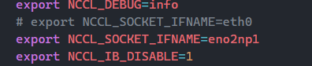

即可


## RDT：ckpt接着训练步骤

修改`/workspace/policy/RDT/finetune.sh`

添加`resume_from_checkpoint`参数

> `resume_from_checkpoint`参数需要的是ckpt的文件名

```bash
RESUME_FROM_CKPT="checkpoint-7500"

accelerate launch --main_process_port=28499  main.py \
    --deepspeed="./configs/zero2.json" \
    --pretrained_model_name_or_path=$PRETRAINED_MODEL_NAME \
    --pretrained_text_encoder_name_or_path=$TEXT_ENCODER_NAME \
    --pretrained_vision_encoder_name_or_path=$VISION_ENCODER_NAME \
    --output_dir=$OUTPUT_DIR \
    --train_batch_size=$TRAIN_BATCH_SIZE \
    --sample_batch_size=$SAMPLE_BATCH_SIZE \
    --max_train_steps=$MAX_TRAIN_STEPS \
    --checkpointing_period=$CHECKPOINTING_PERIOD \
    --sample_period=$SAMPLE_PERIOD \
    --checkpoints_total_limit=$CHECKPOINTS_TOTAL_LIMIT \
    --lr_scheduler="constant" \
    --learning_rate=$LEARNING_RATE \
    --mixed_precision="bf16" \
    --dataloader_num_workers=$DATALOADER_NUM_WORKERS \
    --image_aug \
    --dataset_type="finetune" \
    --state_noise_snr=$STATE_NOISE_SNR \
    --load_from_hdf5 \
    --report_to=wandb \
    --precomp_lang_embed \
    --gradient_accumulation_steps=$GRAD_ACCUM_STEPS \
    --resume_from_checkpoint=$RESUME_FROM_CKPT \    # 添加
    --model_config_path=$CONFIG_FILE \
    --CONFIG_NAME=$CONFIG_NAME
```
